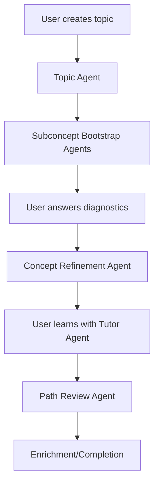

## Overview

Sprout uses seven autonomous AI agents powered by Claude that observe student data, reason about learning patterns, act on the knowledge graph, and verify their own changes. All agents share a common agent loop architecture that enables multi-turn tool calling, retry logic, and reasoning visibility.

<CardGroup cols={2}>
  <Card title="Agent Loop" icon="arrows-spin" href="/agents/agent-loop">
    Shared foundation for all agents with tool calling and reasoning
  </Card>
  
  <Card title="Topic Agent" icon="diagram-project" href="/agents/topic-agent">
    Generates learning paths of 6-10 concepts for any topic
  </Card>
  
  <Card title="Subconcept Agent" icon="sitemap" href="/agents/subconcept-agent">
    Builds diagnostic questions and subconcept DAGs
  </Card>
  
  <Card title="Refinement Agent" icon="wand-magic-sparkles" href="/agents/refinement-agent">
    Personalizes learning paths using the ORAV loop
  </Card>
  
  <Card title="Tutor Agent" icon="chalkboard-user" href="/agents/tutor-agent">
    Teaches concepts chunk-by-chunk with exercises
  </Card>
  
  <Card title="Grading Agent" icon="check-to-slot" href="/agents/grading-agent">
    Evaluates diagnostic answers with semantic understanding
  </Card>
</CardGroup>

## Agent architecture

All agents follow a consistent pattern:

<Steps>
  <Step title="Tool-calling loop">
    Agents use Claude's native tool calling to interact with the database and learning graph. Each agent has access to specialized tools for its domain.
  </Step>
  
  <Step title="Reasoning visibility">
    Claude's reasoning text between tool calls is captured and streamed as `agent_reasoning` SSE events, providing transparency into the agent's decision-making process.
  </Step>
  
  <Step title="Error handling">
    Rate limits are automatically retried with exponential backoff (2s, 4s, 8s). Failed operations are logged and reported via SSE events.
  </Step>
  
  <Step title="Verification">
    Agents verify their own work by checking graph integrity, validating relationships, and ensuring no orphaned nodes exist.
  </Step>
</Steps>

## The seven agents

### Primary agents

These agents handle the core learning pathway generation and adaptation:

<Accordion title="1. Topic Agent">
  **Purpose**: Design a learning path of concepts for any topic.
  
  **Process**:
  - Analyzes the topic and uploaded documents
  - Generates 6-10 concept nodes (or 1-2 in small mode)
  - Extracts relevant document context for each concept
  - Creates prerequisite edges between concepts
  
  **Location**: `sprout-backend/src/agents/topic-agent.ts`
</Accordion>

<Accordion title="2. Subconcept Bootstrap Agent">
  **Purpose**: Build the learning structure for a single concept.
  
  **Process**:
  - Creates 5-10 diagnostic questions (MCQ + open-ended)
  - Generates 8-12 subconcept nodes as a DAG
  - Wires dependency edges between subconcepts
  
  **Location**: `sprout-backend/src/agents/subconcept-bootstrap-agent.ts`
</Accordion>

<Accordion title="3. Concept Refinement Agent">
  **Purpose**: Personalize the subconcept graph after diagnostics.
  
  **Process** (Observe-Reason-Act-Verify loop):
  1. Grade diagnostic answers
  2. Observe current graph and student history
  3. Reason about gaps and misconceptions
  4. Act by adding/removing subconcepts
  5. Verify graph integrity
  6. Verify again after fixes
  
  **This is the star feature** of Sprout's adaptive learning system.
  
  **Location**: `sprout-backend/src/agents/concept-agent.ts`
</Accordion>

<Accordion title="4. Tutor Agent">
  **Purpose**: Teach subconcepts interactively with exercises.
  
  **Process**:
  - Checks diagnostic results and prerequisite mastery
  - Breaks subconcept into 3-6 chunks
  - For each chunk: explain → ask question → evaluate answer
  - Records exercise results and updates mastery scores
  - Marks complete when all chunks are covered
  
  **Location**: `sprout-backend/src/agents/tutor-chat.ts`
</Accordion>

### Supporting agents

These agents provide specialized functionality:

<Accordion title="5. Grade Answers Agent">
  **Purpose**: Grade diagnostic answers with semantic understanding.
  
  **Process**:
  - MCQ answers: Direct correctness check
  - Open-ended answers: Semantic evaluation against rubric
  - Returns correctness, score (0-1), and detailed feedback
  
  **Location**: `sprout-backend/src/agents/grade-answers.ts`
</Accordion>

<Accordion title="6. Generate Diagnostic Agent">
  **Purpose**: Create diagnostic questions for concept assessment.
  
  **Process**:
  - Generates 5-10 questions per concept
  - Mixes MCQ and open-ended formats
  - Varies difficulty levels (1-5 scale)
  - Includes grading rubrics for open-ended questions
  
  **Location**: `sprout-backend/src/agents/generate-diagnostic.ts`
</Accordion>

<Accordion title="7. Review Learning Path Agent">
  **Purpose**: Post-completion path enrichment and remediation.
  
  **Process**:
  - Reviews student mastery across all concepts
  - Identifies areas for enrichment or reinforcement
  - Decides whether to insert additional concepts/subconcepts
  
  **Location**: `sprout-backend/src/agents/review-learning-path.ts`
</Accordion>

## Agent orchestration

Agents are orchestrated through SSE streaming endpoints:

### Topic generation pipeline

```http
POST /api/agents/topics/:topicNodeId/run
```

Two-phase pipeline:
1. **Topic Agent** generates concepts (streamed via SSE)
2. **Subconcept Bootstrap Agents** run in parallel (max 3 concurrent) for each concept

### Concept refinement

```http
POST /api/agents/concepts/:conceptNodeId/run
```

Two-phase response:
- **Phase 1** (no answers yet): Returns diagnostic questions as JSON
- **Phase 2** (answers submitted): Streams concept refinement agent via SSE

### Interactive tutoring

```http
POST /api/chat/sessions/:sessionId/tutor
```

Sends student message, returns tutor response with reasoning. Passes full student context (userId, nodeIds, sessionId) for database queries.

### Path review

```http
POST /api/agents/nodes/:nodeId/review
```

Post-completion enrichment that decides whether to insert additional learning nodes.

## SSE events

All streaming endpoints emit real-time events:

| Event | Data | Description |
|-------|------|-------------|
| `agent_start` | `{ agent }` | Agent has started |
| `agent_reasoning` | `{ agent, text }` | Claude's reasoning between tool calls |
| `tool_call` | `{ tool, input }` | Tool invocation |
| `tool_result` | `{ tool, summary }` | Tool result (truncated to 200 chars) |
| `node_created` | `{ node }` | New node persisted to DB |
| `edge_created` | `{ edge }` | New edge persisted to DB |
| `node_removed` | `{ nodeId }` | Node deleted |
| `edge_removed` | `{ sourceNodeId, targetNodeId }` | Edge deleted |
| `agent_done` | `{ agent, ... }` | Agent completed successfully |
| `agent_error` | `{ agent, message }` | Agent failed |

<Info>
  SSE events provide real-time visibility into agent operations, allowing the frontend to update the 3D graph as nodes and edges are created.
</Info>

## Complete learning flow

Here's how all agents work together:



<Steps>
  <Step title="Topic creation">
    User creates a topic and uploads documents. Topic Agent generates 6-10 concept nodes.
  </Step>
  
  <Step title="Subconcept generation">
    Subconcept Bootstrap Agents run in parallel (max 3 concurrent) to create diagnostics and subconcept DAGs for each concept.
  </Step>
  
  <Step title="Diagnostic assessment">
    User answers 5-10 diagnostic questions. Grade Answers Agent evaluates responses.
  </Step>
  
  <Step title="Path adaptation">
    Concept Refinement Agent personalizes the subconcept graph using the ORAV loop based on diagnostic performance.
  </Step>
  
  <Step title="Interactive learning">
    User learns subconcepts with the Tutor Agent, which teaches chunk-by-chunk and records mastery scores.
  </Step>
  
  <Step title="Path review">
    After completion, Review Learning Path Agent decides if enrichment nodes are needed.
  </Step>
</Steps>

## Next steps

<CardGroup cols={2}>
  <Card title="Agent Loop Implementation" icon="code" href="/agents/agent-loop">
    Dive into the shared agent loop architecture
  </Card>
  
  <Card title="Refinement Agent" icon="wand-magic-sparkles" href="/agents/refinement-agent">
    Learn about the ORAV loop and graph adaptation
  </Card>
</CardGroup>
