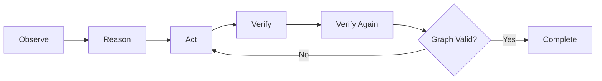

## Purpose

The Concept Refinement Agent is **the star feature** of Sprout's adaptive learning system. After a student answers diagnostic questions, this agent personalizes the subconcept graph by:

- Adding bridge subconcepts for knowledge gaps
- Removing mastered subconcepts to avoid boredom
- Inserting prerequisite concepts for foundational gaps
- Adding follow-up concepts for enrichment
- Verifying graph integrity after changes

**Location**: `sprout-backend/src/agents/concept-agent.ts`

## The ORAV loop

The agent follows an **Observe-Reason-Act-Verify** (ORAV) loop:



<Steps>
  <Step title="Grade diagnostic answers">
    Calls `grade_student_answers` to evaluate diagnostic performance with scores and feedback.
  </Step>
  
  <Step title="Observe">
    Calls `get_current_subconcepts` to view the existing graph and `check_student_history` to see cross-concept performance patterns.
  </Step>
  
  <Step title="Reason">
    Analyzes gaps, misconceptions, and mastery patterns. Decides what changes are needed.
  </Step>
  
  <Step title="Act">
    Adds/removes subconcepts, inserts prerequisite/follow-up concepts using specialized tools.
  </Step>
  
  <Step title="Verify">
    Calls `validate_graph` to check for orphans, broken edges, and unreachable nodes.
  </Step>
  
  <Step title="Verify again">
    After fixing issues, validates once more to ensure graph integrity.
  </Step>
</Steps>

<Info>
  The double verification ensures that graph modifications don't create structural problems like orphaned nodes or circular dependencies.
</Info>

## Agent tools

The Concept Refinement Agent has the most powerful toolset:

### Observation tools

<Accordion title="grade_student_answers">
  Grades all diagnostic answers for the concept.
  
  **Input**:
  ```json
  {
    "conceptNodeId": "concept-uuid-123"
  }
  ```
  
  **Output**:
  ```json
  {
    "summary": {
      "total_questions": 8,
      "correct": 5,
      "incorrect": 3,
      "average_score": 0.625,
      "weak_areas": ["deletion", "balancing"],
      "strong_areas": ["searching", "insertion"]
    },
    "answers": [
      {
        "questionId": "q1",
        "isCorrect": true,
        "score": 1.0,
        "feedback": "Correct! You understand BST properties."
      }
    ]
  }
  ```
</Accordion>

<Accordion title="get_current_subconcepts">
  Retrieves the existing subconcept graph.
  
  **Input**:
  ```json
  {
    "conceptNodeId": "concept-uuid-123"
  }
  ```
  
  **Output**:
  ```json
  {
    "subconcepts": [
      { "id": "sub1", "title": "BST Node Structure", "desc": "..." },
      { "id": "sub2", "title": "BST Properties", "desc": "..." }
    ],
    "edges": [
      { "source": "sub1", "target": "sub2" }
    ]
  }
  ```
</Accordion>

<Accordion title="check_student_history">
  Retrieves cross-concept performance data.
  
  **Input**:
  ```json
  {
    "userId": "user-uuid-456"
  }
  ```
  
  **Output**:
  ```json
  {
    "mastery_scores": {
      "Arrays and Strings": 0.85,
      "Linked Lists": 0.72,
      "Stacks and Queues": 0.68
    },
    "completed_nodes": 12,
    "in_progress_nodes": 3,
    "overall_level": "intermediate",
    "learning_pace": "moderate"
  }
  ```
</Accordion>

### Action tools

<Accordion title="add_subconcept">
  Adds a bridge or remedial subconcept for knowledge gaps.
  
  **Input**:
  ```json
  {
    "title": "BST Deletion Edge Cases",
    "description": "Handling deletion when node has two children",
    "prerequisiteIds": ["sub5"],
    "reason": "Student struggled with deletion question - needs focused practice on edge cases"
  }
  ```
  
  **Output**:
  ```json
  {
    "nodeId": "sub-new-123",
    "success": true,
    "edges_created": 2
  }
  ```
</Accordion>

<Accordion title="remove_subconcept">
  Removes a mastered subconcept and reconnects edges.
  
  **Input**:
  ```json
  {
    "subconceptId": "sub2",
    "reason": "Student demonstrated full mastery of BST properties in diagnostic"
  }
  ```
  
  **Output**:
  ```json
  {
    "success": true,
    "reconnected_edges": 3,
    "affected_nodes": ["sub1", "sub3", "sub4"]
  }
  ```
  
  The tool automatically reconnects prerequisite edges so dependent subconcepts aren't orphaned.
</Accordion>

<Accordion title="add_prerequisite_concept">
  Inserts a concept BEFORE the current concept in the topic path.
  
  **Input**:
  ```json
  {
    "title": "Recursion Fundamentals",
    "description": "Base cases, recursive cases, and call stack",
    "reason": "Student lacks recursion knowledge needed for tree traversals"
  }
  ```
  
  **Output**:
  ```json
  {
    "conceptId": "concept-new-456",
    "success": true,
    "position": "before_current"
  }
  ```
</Accordion>

<Accordion title="add_followup_concept">
  Inserts a concept AFTER the current concept for enrichment.
  
  **Input**:
  ```json
  {
    "title": "Advanced BST: Red-Black Trees",
    "description": "Self-balancing BST with color properties",
    "reason": "Student exceeded expectations - ready for advanced material"
  }
  ```
  
  **Output**:
  ```json
  {
    "conceptId": "concept-new-789",
    "success": true,
    "position": "after_current"
  }
  ```
</Accordion>

### Verification tools

<Accordion title="validate_graph">
  Checks graph integrity using BFS.
  
  **Input**:
  ```json
  {
    "conceptNodeId": "concept-uuid-123"
  }
  ```
  
  **Output** (valid graph):
  ```json
  {
    "valid": true,
    "subconcept_count": 10,
    "edge_count": 15,
    "entry_points": 2,
    "unreachable_nodes": []
  }
  ```
  
  **Output** (invalid graph):
  ```json
  {
    "valid": false,
    "issues": [
      {
        "type": "orphaned_node",
        "nodeId": "sub7",
        "message": "Node has no incoming or outgoing edges"
      },
      {
        "type": "unreachable",
        "nodeId": "sub9",
        "message": "Node cannot be reached from any entry point"
      }
    ],
    "suggested_fixes": [
      "Connect sub7 to sub6",
      "Add edge from sub8 to sub9"
    ]
  }
  ```
</Accordion>

## Example refinement

Here's a real example of how the agent adapts a learning path:

### Initial diagnostic results

```json
{
  "total_questions": 8,
  "correct": 4,
  "incorrect": 4,
  "weak_areas": ["tree_traversals", "deletion"],
  "strong_areas": ["searching", "insertion"],
  "misconception_detected": "Student confuses in-order and pre-order traversal"
}
```

### Agent reasoning

```
Observation: Student scored 50% on diagnostics. 
Strong performance on searching/insertion but struggled with traversals and deletion.
Detected confusion between traversal types.

Student history shows 0.85 mastery on "Arrays and Strings" and 0.72 on "Linked Lists".
Overall level: intermediate. Learning pace: moderate.

Current graph has 10 subconcepts. Tree traversal subconcept exists but may be too brief.

Reasoning: 
1. Add bridge subconcept on "Traversal Comparison" to clarify differences
2. Add remedial subconcept on "Deletion with Two Children" (common edge case)
3. Keep searching/insertion subconcepts but mark as "review" priority
4. Don't remove any subconcepts - student needs full coverage

Actions:
- add_subconcept: "In-order vs Pre-order vs Post-order Comparison"
- add_subconcept: "Deletion: Node with Two Children"
- No removals

Verification: Running validate_graph...
Result: All nodes reachable, no orphans. Graph valid.
```

### Agent actions

<Steps>
  <Step title="Add comparison subconcept">
    ```json
    add_subconcept({
      "title": "In-order vs Pre-order vs Post-order",
      "description": "Visual comparison of traversal types with examples",
      "prerequisiteIds": ["sub5-basic-traversals"],
      "reason": "Student confused traversal types in diagnostic"
    })
    ```
  </Step>
  
  <Step title="Add deletion edge case">
    ```json
    add_subconcept({
      "title": "Deletion: Node with Two Children",
      "description": "Finding successor/predecessor and swapping",
      "prerequisiteIds": ["sub7-basic-deletion"],
      "reason": "Diagnostic revealed gap in deletion edge cases"
    })
    ```
  </Step>
  
  <Step title="Validate graph">
    ```json
    validate_graph({ "conceptNodeId": "concept-uuid-123" })
    // Returns: { "valid": true, "subconcept_count": 12 }
    ```
  </Step>
</Steps>

<Info>
  The agent increased subconcepts from 10 to 12, focusing on the student's specific gaps without overwhelming them.
</Info>

## API endpoint

```http
POST /api/agents/concepts/:conceptNodeId/run
```

**Two-phase response**:

### Phase 1: No answers yet

Returns diagnostic questions as JSON:

```json
{
  "phase": "diagnostic",
  "questions": [
    {
      "id": "q1",
      "format": "mcq",
      "prompt": "What is the time complexity of searching in a BST?",
      "options": ["O(1)", "O(log n)", "O(n)", "O(n^2)"],
      "difficulty": 2
    }
  ]
}
```

### Phase 2: Answers exist

Streams refinement agent via SSE:

```typescript
eventSource.addEventListener("agent_start", (e) => {
  console.log("Concept refinement started");
});

eventSource.addEventListener("agent_reasoning", (e) => {
  const { text } = JSON.parse(e.data);
  console.log(`Reasoning: ${text}`);
});

eventSource.addEventListener("node_created", (e) => {
  const { node } = JSON.parse(e.data);
  console.log(`Added subconcept: ${node.title}`);
});

eventSource.addEventListener("node_removed", (e) => {
  const { nodeId } = JSON.parse(e.data);
  console.log(`Removed subconcept: ${nodeId}`);
});

eventSource.addEventListener("agent_done", (e) => {
  console.log("Path personalization complete");
});
```

## Performance considerations

**Token usage**: 15,000-30,000 tokens per refinement
- Diagnostic results: ~1,000 tokens
- Student history: ~500 tokens
- Current graph: ~2,000 tokens
- Reasoning: ~5,000 tokens
- Tool calls: ~10,000 tokens
- Verification: ~2,000 tokens

**Latency**: 60-120 seconds
- Grading: 10-20 seconds
- Observation: 5-10 seconds
- Reasoning + Actions: 30-60 seconds
- Verification: 10-20 seconds

<Tip>
  Use SSE streaming to provide real-time feedback. Show reasoning steps and graph changes as they happen so students understand why their path is being adapted.
</Tip>

## Next steps

<CardGroup cols={2}>
  <Card title="Tutor Agent" icon="chalkboard-user" href="/agents/tutor-agent">
    Learn how the tutor teaches adapted subconcepts
  </Card>
  
  <Card title="Adaptive Learning" icon="wand-magic-sparkles" href="/features/adaptive-learning">
    See the full adaptive learning experience
  </Card>
</CardGroup>
