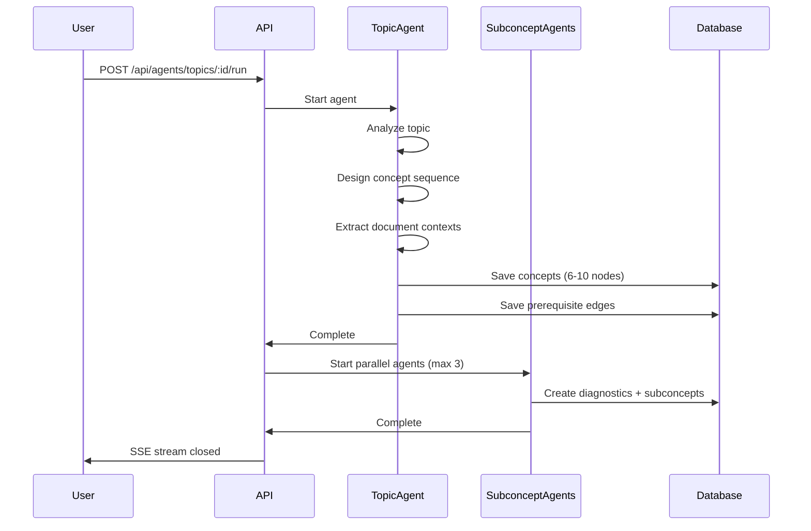

## Purpose

The Topic Agent designs a complete learning path by breaking down any topic into 6-10 concept nodes (or 1-2 in small mode) with prerequisite relationships.

**Location**: `sprout-backend/src/agents/topic-agent.ts`

## Process flow

<Steps>
  <Step title="Analyze topic and documents">
    The agent receives the topic title and uploaded document texts. It analyzes the subject matter to determine key concepts.
  </Step>
  
  <Step title="Design concept sequence">
    Decides on 6-10 concepts that build on each other, forming a logical learning progression.
  </Step>
  
  <Step title="Extract document context">
    Uses `extract_all_concept_contexts` to batch-extract relevant sections from uploaded documents for each concept.
  </Step>
  
  <Step title="Save concepts">
    Creates concept nodes in order using `save_concept`, persisting title, description, and document context.
  </Step>
  
  <Step title="Create prerequisite edges">
    Wires concepts together with `save_concept_edge` to form a dependency graph (typically a chain or DAG).
  </Step>
</Steps>

## Agent tools

The Topic Agent has access to three specialized tools:

<Accordion title="extract_all_concept_contexts">
  Batch-extracts relevant document sections for all concepts.
  
  **Input**:
  ```json
  {
    "concepts": [
      { "title": "Binary Search Trees", "description": "..." },
      { "title": "Tree Traversals", "description": "..." }
    ]
  }
  ```
  
  **Output**:
  ```json
  {
    "contexts": [
      {
        "concept": "Binary Search Trees",
        "relevant_sections": "A binary search tree is a node-based data structure..."
      },
      {
        "concept": "Tree Traversals",
        "relevant_sections": "There are three main ways to traverse a tree..."
      }
    ]
  }
  ```
  
  This tool extracts relevant content from uploaded documents (PDFs, text files) and associates it with each concept.
</Accordion>

<Accordion title="save_concept">
  Creates a concept node in the database.
  
  **Input**:
  ```json
  {
    "title": "Binary Search Trees",
    "description": "Self-balancing trees with O(log n) operations",
    "documentContext": "A binary search tree is a node-based..."
  }
  ```
  
  **Output**:
  ```json
  {
    "nodeId": "concept-uuid-123",
    "success": true
  }
  ```
  
  The created node is persisted to the `nodes` table with type `concept`.
</Accordion>

<Accordion title="save_concept_edge">
  Creates a prerequisite edge between two concepts.
  
  **Input**:
  ```json
  {
    "sourceConceptId": "concept-uuid-123",
    "targetConceptId": "concept-uuid-456",
    "reason": "Tree Traversals requires understanding BST structure first"
  }
  ```
  
  **Output**:
  ```json
  {
    "edgeId": "edge-uuid-789",
    "success": true
  }
  ```
  
  Edges are stored in the `nodeEdges` table and represent prerequisite relationships.
</Accordion>

## Example topic breakdown

Here's how the Topic Agent might break down "Data Structures and Algorithms":

```
1. Arrays and Strings (foundation)
   ↓
2. Linked Lists
   ↓
3. Stacks and Queues
   ↓
4. Hash Tables
   ↓
5. Trees and Binary Search Trees
   ↓
6. Tree Traversals
   ↓
7. Graphs and BFS/DFS
   ↓
8. Dynamic Programming Basics
   ↓
9. Sorting Algorithms
   ↓
10. Advanced Graph Algorithms
```

Each concept builds on previous ones, forming a logical learning progression.

## SSE events

The Topic Agent streams real-time events during execution:

```typescript
// Frontend code to listen for Topic Agent events
const eventSource = new EventSource(
  `/api/agents/topics/${topicNodeId}/run`
);

eventSource.addEventListener("agent_start", (e) => {
  const { agent } = JSON.parse(e.data);
  console.log(`${agent} started`);
});

eventSource.addEventListener("agent_reasoning", (e) => {
  const { agent, text } = JSON.parse(e.data);
  console.log(`Reasoning: ${text}`);
});

eventSource.addEventListener("node_created", (e) => {
  const { node } = JSON.parse(e.data);
  console.log(`Created concept: ${node.title}`);
  // Add node to 3D graph
});

eventSource.addEventListener("edge_created", (e) => {
  const { edge } = JSON.parse(e.data);
  console.log(`Created edge: ${edge.sourceNodeId} -> ${edge.targetNodeId}`);
  // Add edge to 3D graph
});

eventSource.addEventListener("agent_done", (e) => {
  const { agent } = JSON.parse(e.data);
  console.log(`${agent} completed`);
  eventSource.close();
});
```

<Info>
  The frontend uses these SSE events to update the 3D graph in real-time as concepts are created.
</Info>

## API endpoint

```http
POST /api/agents/topics/:topicNodeId/run
```

**Request body**:
```json
{
  "small": false
}
```

**Response**: SSE stream with events:
- `agent_start`
- `agent_reasoning`
- `tool_call`
- `tool_result`
- `node_created`
- `edge_created`
- `agent_done`

<ParamField path="small" type="boolean">
  If `true`, generates 1-2 concepts instead of 6-10 for cost-efficient testing.
</ParamField>

## Small mode

Small mode is useful for testing without incurring high API costs:

```bash
curl -X POST http://localhost:8000/api/agents/topics/topic-123/run \
  -H "Content-Type: application/json" \
  -d '{ "small": true }'
```

**Small mode behavior**:
- Generates **1-2 concepts** instead of 6-10
- Fewer tool calls and iterations
- Faster execution (10-30 seconds vs 60-150 seconds)
- Lower token usage (~5,000 tokens vs ~30,000 tokens)

<Warning>
  Small mode creates incomplete learning paths. Use it only for testing and development.
</Warning>

## Orchestration

The Topic Agent is the first step in a two-phase pipeline:



<Steps>
  <Step title="Phase 1: Topic Agent">
    Generates 6-10 concept nodes with prerequisite edges.
  </Step>
  
  <Step title="Phase 2: Subconcept Bootstrap Agents">
    For each concept created, a Subconcept Bootstrap Agent runs in parallel (max 3 concurrent) to create diagnostics and subconcept DAGs.
  </Step>
</Steps>

## Implementation details

From `sprout-backend/src/agents/topic-agent.ts`:

```typescript
export async function runTopicAgent({
  topicNodeId,
  userId,
  small = false,
  sseWriter
}: TopicAgentParams) {
  // Load topic and documents
  const topic = await db.query.nodes.findFirst({
    where: eq(nodes.id, topicNodeId)
  });
  
  const documents = await db.query.topicDocuments.findMany({
    where: eq(topicDocuments.nodeId, topicNodeId)
  });
  
  const documentTexts = documents
    .filter(d => d.extractedText)
    .map(d => d.extractedText)
    .join("\n\n");
  
  // System prompt
  const systemPrompt = `
    You are an expert curriculum designer. Design a learning path for:
    Topic: ${topic.title}
    ${topic.desc ? `Description: ${topic.desc}` : ""}
    
    ${small ? "Create 1-2 concepts for testing." : "Create 6-10 concepts."}
    
    Available documents:
    ${documentTexts || "No documents uploaded."}
  `;
  
  // Run agent loop
  const result = await agentLoop({
    systemPrompt,
    userMessage: "Design the learning path.",
    tools: topicAgentTools,
    maxIterations: 15,
    callbacks: {
      onThinking: (text) => sseWriter.send("agent_reasoning", { agent: "topic", text }),
      onToolCall: (tool, input) => sseWriter.send("tool_call", { tool, input }),
      onToolResult: (tool, result) => {
        const summary = result.substring(0, 200);
        sseWriter.send("tool_result", { tool, summary });
      }
    }
  });
  
  return result;
}
```

## Document context extraction

The `extract_all_concept_contexts` tool uses semantic search to find relevant sections:

```typescript
function extractConceptContext(concept: string, documents: string): string {
  // Simple keyword matching (production would use embeddings)
  const keywords = concept.toLowerCase().split(" ");
  const sentences = documents.split(". ");
  
  const relevantSentences = sentences.filter(sentence => {
    const lower = sentence.toLowerCase();
    return keywords.some(keyword => lower.includes(keyword));
  });
  
  return relevantSentences.slice(0, 10).join(". ");
}
```

<Note>
  In production, this would use vector embeddings (e.g., OpenAI embeddings) to find semantically similar document sections.
</Note>

## Next steps

<CardGroup cols={2}>
  <Card title="Subconcept Agent" icon="sitemap" href="/agents/subconcept-agent">
    Learn how subconcepts and diagnostics are generated
  </Card>
  
  <Card title="API Reference" icon="code" href="/api/agents">
    Full API documentation for agent endpoints
  </Card>
</CardGroup>
