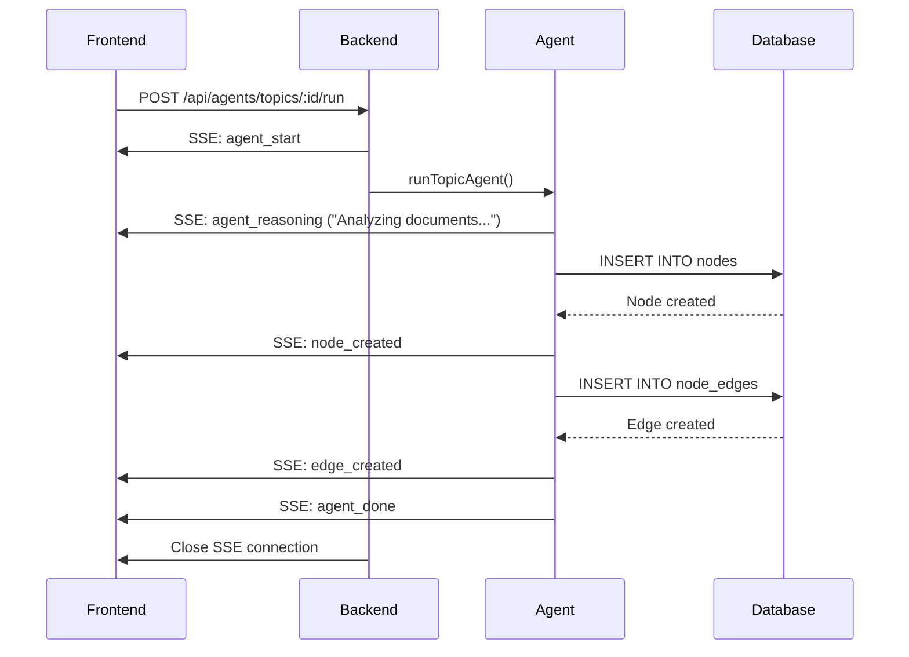

The Sprout frontend is a Next.js 16 application that visualizes learning graphs in both 3D (Three.js) and 2D (React Flow), streams real-time agent progress via SSE, and supports hand tracking for natural interaction.

## Core Technologies

<Tabs>
  <Tab title="Framework">
    - **Next.js 16**: React Server Components + App Router
    - **React 19**: Latest concurrent features
    - **TypeScript**: Full type safety
    - **Tailwind CSS 4**: Utility-first styling
    - **Motion**: Animation library (12.34.3)
  </Tab>
  <Tab title="Graph Rendering">
    - **react-force-graph-3d**: Physics-based 3D graphs with Three.js
    - **@xyflow/react**: Dagre-based 2D graph layout
    - **@dagrejs/dagre**: Hierarchical graph layout algorithm
    - **d3-force**: Force simulation for node positioning
  </Tab>
  <Tab title="Interactive Features">
    - **@excalidraw/excalidraw**: Drawing-based learning blocks
    - **lucide-react**: Icon library
    - **radix-ui**: Accessible UI primitives
    - **WebSocket**: Hand tracking connection
  </Tab>
</Tabs>

## Application Structure

```
sprout-frontend/
├── src/
│   ├── app/                    # Next.js App Router pages
│   │   ├── page.tsx           # Root redirect
│   │   ├── graph/page.tsx     # 3D graph view
│   │   ├── learn/             # Learning interface
│   │   │   ├── page.tsx       # Subconcept learning view
│   │   │   └── layout.tsx     # Shared learning layout
│   │   └── layout.tsx         # Root layout
│   ├── components/             # React components
│   │   ├── graph-view.tsx     # Main graph orchestrator
│   │   ├── force-graph-view.tsx # 3D visualization
│   │   ├── graph-canvas.tsx   # 2D React Flow canvas
│   │   ├── graph-node.tsx     # Node rendering logic
│   │   ├── graph-sidebar.tsx  # Navigation sidebar
│   │   ├── learn-view.tsx     # Learning interface
│   │   ├── hand-cursor.tsx    # Hand tracking overlay
│   │   └── ui/                # Shadcn/Radix components
│   ├── hooks/                  # Custom React hooks
│   │   ├── use-agent-stream.ts # SSE streaming hook
│   │   └── use-hand-tracking.ts # WebSocket hand tracking
│   └── lib/                    # Utilities
│       ├── backend-api.ts     # API client functions
│       └── graph-utils.ts     # Graph data transformations
```

## Graph Visualization

### 3D Force Graph (`ForceGraphView`)

The global view uses physics-based 3D rendering with Three.js:

```typescript src/components/force-graph-view.tsx
import ForceGraph3D from 'react-force-graph-3d';
import * as THREE from 'three';

export function ForceGraphView({
  branches, nodes, dependencyEdges,
  highlightedBranchId, focusedNodeId,
  onNodeClick, handPos, hands
}) {
  const graphRef = useRef<any>(null);

  // Build force graph data
  const graphData = useMemo(() => {
    return toForceGraphData(nodes, dependencyEdges);
  }, [nodes, dependencyEdges]);

  // Branch clustering forces
  useEffect(() => {
    const fg = graphRef.current;
    if (!fg) return;

    // X/Y forces pull nodes toward branch centers
    fg.d3Force('x', forceX((node: ForceNode) => {
      if (!node.branchId) return 0;
      return branchCenters.get(node.branchId)?.x ?? 0;
    }).strength(0.3));

    fg.d3Force('y', forceY((node: ForceNode) => {
      if (!node.branchId) return 0;
      return branchCenters.get(node.branchId)?.y ?? 0;
    }).strength(0.3));

    fg.d3Force('charge')?.strength(-80);
    fg.d3Force('link')?.distance(40);
    fg.d3ReheatSimulation();
  }, [branchCenters]);

  // Render nodes as Three.js spheres
  const nodeThreeObject = useCallback((node: ForceNode) => {
    const radius = node.variant === 'root' ? 3 
                 : node.variant === 'concept' ? 2 : 1;
    const color = node.variant === 'root' ? '#ffffff' 
                : branchColors.get(node.branchId)?.[node.variant];
    const opacity = node.completed ? 1 : 0.6;

    const geometry = new THREE.SphereGeometry(radius, 16, 16);
    const material = new THREE.MeshStandardMaterial({
      color, transparent: true, opacity,
      emissive: node.id === focusedNodeId 
        ? new THREE.Color(color) 
        : new THREE.Color(0x000000),
      emissiveIntensity: node.id === focusedNodeId ? 0.6 : 0
    });
    const mesh = new THREE.Mesh(geometry, material);

    // Add text sprite label
    if (node.variant !== 'subconcept' || highlightedBranchId) {
      const sprite = createTextSprite(node.label, opacity);
      sprite.position.set(0, -(radius + 3), 0);
      mesh.add(sprite);
    }

    return mesh;
  }, [focusedNodeId, highlightedBranchId, branchColors]);

  return (
    <ForceGraph3D
      ref={graphRef}
      graphData={graphData}
      backgroundColor="#0A1A0F"
      nodeThreeObject={nodeThreeObject}
      onNodeClick={focusAndSelect}
      linkColor={linkColor}
      cooldownTicks={100}
      enableNodeDrag={true}
    />
  );
}
```

<Note>
**Branch Clustering**: D3 forces create orbital layouts where each topic's concepts cluster around a radial center point.
</Note>

### 2D React Flow Canvas (`GraphCanvas`)

Branch and concept views use React Flow with Dagre layout:

```typescript src/components/graph-canvas.tsx
import { ReactFlow, useNodesState, useEdgesState } from '@xyflow/react';
import dagre from '@dagrejs/dagre';

const dagreGraph = new dagre.graphlib.Graph();
dagreGraph.setDefaultEdgeLabel(() => ({}));

function getLayoutedElements(nodes: Node[], edges: Edge[]) {
  dagreGraph.setGraph({ rankdir: 'TB', ranksep: 120, nodesep: 80 });

  nodes.forEach((node) => {
    dagreGraph.setNode(node.id, { width: 200, height: 80 });
  });

  edges.forEach((edge) => {
    dagreGraph.setEdge(edge.source, edge.target);
  });

  dagre.layout(dagreGraph);

  return {
    nodes: nodes.map((node) => {
      const pos = dagreGraph.node(node.id);
      return { ...node, position: { x: pos.x, y: pos.y } };
    }),
    edges
  };
}

export default function GraphCanvas({
  nodes, edges, onNodeClick, expandedNodeId, onOpenConcept
}) {
  const [layoutedNodes, layoutedEdges] = useMemo(() => {
    const { nodes: lNodes, edges: lEdges } = getLayoutedElements(nodes, edges);
    return [lNodes, lEdges];
  }, [nodes, edges]);

  const [rfNodes, , onNodesChange] = useNodesState(layoutedNodes);
  const [rfEdges, , onEdgesChange] = useEdgesState(layoutedEdges);

  return (
    <ReactFlow
      nodes={rfNodes}
      edges={rfEdges}
      onNodesChange={onNodesChange}
      onEdgesChange={onEdgesChange}
      onNodeClick={(_, node) => onNodeClick(node.id)}
      nodeTypes={{ graph: GraphNode }}
      fitView
      minZoom={0.1}
      maxZoom={2}
    >
      <Background />
      <Controls />
    </ReactFlow>
  );
}
```

## Real-Time SSE Streaming

The `useAgentStream` hook manages SSE connections:

```typescript src/hooks/use-agent-stream.ts
export function useAgentStream({ onMutation }: UseAgentStreamOptions) {
  const [isStreaming, setIsStreaming] = useState(false);
  const [error, setError] = useState<string | null>(null);
  const [activityLog, setActivityLog] = useState<ActivityLogEntry[]>([]);
  const eventSourceRef = useRef<EventSource | null>(null);
  const knownNodeIdsRef = useRef(new Set<string>());

  const startStream = useCallback(async (url: string, body: object) => {
    setIsStreaming(true);
    setError(null);
    setActivityLog([]);

    const es = new EventSource(
      `${url}?${new URLSearchParams({ ...body }).toString()}`
    );
    eventSourceRef.current = es;

    // Agent lifecycle events
    es.addEventListener('agent_start', (e) => {
      const data = JSON.parse(e.data);
      addActivityLog({ type: 'agent_start', agent: data.agent });
    });

    es.addEventListener('agent_reasoning', (e) => {
      const data = JSON.parse(e.data);
      addActivityLog({ 
        type: 'reasoning', 
        agent: data.agent, 
        text: data.text 
      });
    });

    // Graph mutation events
    es.addEventListener('node_created', (e) => {
      const data = JSON.parse(e.data);
      if (!knownNodeIdsRef.current.has(data.node.id)) {
        knownNodeIdsRef.current.add(data.node.id);
        onMutation({ kind: 'node_created', node: data.node });
        addActivityLog({ type: 'node_created', node: data.node });
      }
    });

    es.addEventListener('edge_created', (e) => {
      const data = JSON.parse(e.data);
      onMutation({ kind: 'edge_created', edge: data.edge });
      addActivityLog({ type: 'edge_created', edge: data.edge });
    });

    es.addEventListener('node_removed', (e) => {
      const data = JSON.parse(e.data);
      knownNodeIdsRef.current.delete(data.nodeId);
      onMutation({ kind: 'node_removed', nodeId: data.nodeId });
    });

    es.addEventListener('agent_done', (e) => {
      const data = JSON.parse(e.data);
      addActivityLog({ type: 'agent_done', agent: data.agent });
    });

    es.addEventListener('agent_error', (e) => {
      const data = JSON.parse(e.data);
      setError(data.message);
      addActivityLog({ type: 'error', message: data.message });
    });

    es.onerror = () => {
      setIsStreaming(false);
      es.close();
    };
  }, [onMutation]);

  const cancelStream = useCallback(() => {
    eventSourceRef.current?.close();
    setIsStreaming(false);
  }, []);

  return { startStream, cancelStream, isStreaming, error, activityLog };
}
```

### SSE Event Flow



## Hand Tracking Integration

Hand tracking uses a WebSocket connection to a Python CV service:

```typescript src/hooks/use-hand-tracking.ts
export function useHandTracking(wsUrl: string, enabled: boolean) {
  const [handPos, setHandPos] = useState<HandPosition | null>(null);
  const [hands, setHands] = useState<HandSample[]>([]);
  const [connected, setConnected] = useState(false);
  const wsRef = useRef<WebSocket | null>(null);

  useEffect(() => {
    if (!enabled) {
      wsRef.current?.close();
      setConnected(false);
      return;
    }

    const ws = new WebSocket(wsUrl);
    wsRef.current = ws;

    ws.onopen = () => setConnected(true);
    ws.onclose = () => setConnected(false);

    ws.onmessage = (event) => {
      const data = JSON.parse(event.data);
      setHands(data.hands || []);

      // Use right hand palm for camera control
      const rightHand = data.hands?.find(
        (h: HandSample) => h.handedness === 'Right'
      );
      if (rightHand) {
        setHandPos({
          x: rightHand.palm_x,
          y: rightHand.palm_y,
          z: rightHand.palm_z,
          pinch: rightHand.pinch_distance
        });
      } else {
        setHandPos(null);
      }
    };

    return () => ws.close();
  }, [wsUrl, enabled]);

  return { handPos, hands, connected };
}
```

### Hand Gesture Controls

<Tabs>
  <Tab title="Camera Orbit">
    - **Palm Position (X/Y)**: Rotates camera around graph
    - **Pinch Distance**: Controls zoom level (closer = zoom in)
    - **Smooth Interpolation**: 60fps lerping for fluid motion
  </Tab>
  <Tab title="Node Grabbing">
    - **Open Palm Hold (3s)**: Locks onto nearest root/concept node
    - **Grab State**: Moves node + its subconcepts together
    - **Release**: Freezes nodes in new position
    - **Multi-Hand**: Only one grab active at a time
  </Tab>
</Tabs>

```typescript Hand Tracking rAF Loop
useEffect(() => {
  const animate = () => {
    rafRef.current = requestAnimationFrame(animate);
    const fg = graphRef.current;
    if (!fg) return;

    const target = targetHandRef.current;
    if (!target) return;

    // Lerp smoothed position toward target
    if (!smoothHandRef.current) {
      smoothHandRef.current = { x: target.x, y: target.y };
    } else {
      smoothHandRef.current.x += (target.x - smoothHandRef.current.x) * 0.06;
      smoothHandRef.current.y += (target.y - smoothHandRef.current.y) * 0.06;
    }

    // Map pinch [0.02, 0.35] → camera radius [80, 550]
    const clampedPinch = Math.max(0.02, Math.min(0.35, target.pinch));
    const targetR = 80 + ((clampedPinch - 0.02) / 0.33) * 470;
    smoothRRef.current += (targetR - smoothRRef.current) * 0.05;

    const theta = (smoothHandRef.current.x - 0.5) * 2 * Math.PI;
    const phi = (0.5 - smoothHandRef.current.y) * (Math.PI / 3);
    const r = smoothRRef.current;

    // Update camera position (duration=0 for manual interpolation)
    fg.cameraPosition(
      {
        x: center.x + r * Math.cos(phi) * Math.sin(theta),
        y: center.y + r * Math.sin(phi),
        z: center.z + r * Math.cos(phi) * Math.cos(theta)
      },
      { x: center.x, y: center.y, z: center.z },
      0
    );
  };

  rafRef.current = requestAnimationFrame(animate);
  return () => cancelAnimationFrame(rafRef.current!);
}, []);
```

## State Management

Sprout uses React hooks and refs for state management:

### Graph State

```typescript Graph State Pattern
const [backendNodes, setBackendNodes] = useState<BackendNode[]>([]);
const [graphNodes, setGraphNodes] = useState<GraphNode[]>([]);
const [conceptEdgesByRootId, setConceptEdgesByRootId] = useState<
  Record<string, BackendEdge[]>
>({});

// Ref mirror for SSE mutation handler (avoids stale closures)
const backendNodesRef = useRef<BackendNode[]>([]);
useEffect(() => {
  backendNodesRef.current = backendNodes;
}, [backendNodes]);

const handleStreamMutation = useCallback((mutation: StreamMutation) => {
  switch (mutation.kind) {
    case 'node_created': {
      // Sync ref immediately so edge_created can find this node
      if (!backendNodesRef.current.some(n => n.id === mutation.node.id)) {
        backendNodesRef.current = [...backendNodesRef.current, mutation.node];
      }
      setBackendNodes(prev => [...prev, mutation.node]);
      setGraphNodes(prev => [...prev, mapToGraphNode(mutation.node)]);
      break;
    }
    case 'edge_created': {
      // Use ref to find source/target nodes (may have just been created)
      const nodes = backendNodesRef.current;
      const sourceNode = nodes.find(n => n.id === mutation.edge.sourceNodeId);
      const targetNode = nodes.find(n => n.id === mutation.edge.targetNodeId);
      // ... classify and store edge
      break;
    }
  }
}, []);
```

<Info>
**Ref Pattern**: Using refs alongside state ensures SSE mutation handlers always read fresh data, even when events arrive in rapid succession (same microtask).
</Info>

## Learning Interface

The learning view (`src/components/learn-view.tsx`) handles subconcept teaching:

```typescript Learning Blocks
type BlockType = 'text' | 'mcq' | 'code' | 'draw';

interface LearningBlock {
  id: string;
  type: BlockType;
  content: string;
  question?: string;
  options?: string[];
  correctAnswer?: string;
}

// Render different block types
function renderBlock(block: LearningBlock) {
  switch (block.type) {
    case 'text':
      return <MarkdownLite content={block.content} />;
    
    case 'mcq':
      return (
        <MultipleChoice
          question={block.question}
          options={block.options}
          onSubmit={handleMCQSubmit}
        />
      );
    
    case 'code':
      return (
        <CodeEditor
          initialCode={block.content}
          onRun={handleCodeRun}
        />
      );
    
    case 'draw':
      return (
        <ExcalidrawBoard
          prompt={block.question}
          onSubmit={handleDrawingSubmit}
        />
      );
  }
}
```

## Performance Optimizations

### 1. Memoization

```typescript
const filteredNodes = useMemo(() => {
  if (view.level === 'branch') {
    return getConceptNodesForBranch(graphNodes, view.branchId);
  }
  if (view.level === 'concept') {
    return getSubconceptNodesForConcept(graphNodes, view.conceptId);
  }
  return [];
}, [view, graphNodes]);
```

### 2. Debounced Graph Layout

```typescript
const [layoutedNodes, layoutedEdges] = useMemo(() => {
  // Only recompute Dagre layout when nodes/edges actually change
  return getLayoutedElements(nodes, edges);
}, [nodes, edges]);
```

### 3. Virtual Scrolling

Sidebar uses Radix ScrollArea for performance with large branch lists.

## Next Steps

<CardGroup cols={2}>
  <Card title="Database Schema" icon="database" href="/architecture/database">
    Explore the SQLite data model and relationships
  </Card>
  <Card title="Agent Loop" icon="robot" href="/agents/introduction">
    Learn how AI agents orchestrate the learning graph
  </Card>
</CardGroup>