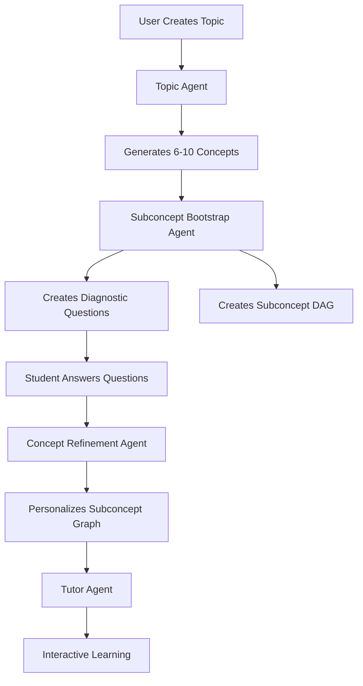

Sprout is an AI-powered adaptive learning platform that builds personalized learning pathways on any topic. The system uses seven autonomous Claude-powered agents to generate 3D knowledge graphs, diagnostic assessments, and interactive tutoring.

## System Architecture

Sprout follows a modern full-stack architecture with clear separation between frontend visualization, backend orchestration, and AI agent processing.

<Tabs>
  <Tab title="Frontend">
    - **Framework**: Next.js 16 with React 19
    - **3D Visualization**: Three.js + react-force-graph-3d
    - **2D Graph**: React Flow (@xyflow/react)
    - **Real-time**: Server-Sent Events (SSE) for agent streaming
    - **Hand Tracking**: WebSocket connection to Python CV service
  </Tab>
  <Tab title="Backend">
    - **Framework**: Express 5 with TypeScript
    - **AI**: Anthropic Claude SDK (claude-3.5-sonnet)
    - **Database**: SQLite with Drizzle ORM
    - **Storage**: AWS S3 for document uploads
    - **Streaming**: SSE for real-time agent progress
  </Tab>
  <Tab title="AI Agents">
    - **Topic Agent**: Generates concept sequences
    - **Subconcept Bootstrap**: Creates learning structure
    - **Concept Refinement**: Personalizes based on diagnostics
    - **Tutor Agent**: Interactive chunk-based teaching
    - **Grade Answers**: Evaluates student responses
    - **Generate Diagnostic**: Creates assessment questions
    - **Review Path**: Post-completion enrichment
  </Tab>
</Tabs>

## Data Flow



## Key Design Principles

### 1. Agent-Based Architecture

All AI agents run through a shared **agent loop** (`src/agents/agent-loop.ts`) that handles:
- Multi-turn tool calling with Claude
- Retry logic with exponential backoff for rate limits
- Reasoning visibility via SSE callbacks
- Configurable iteration limits (5-15 rounds)

<Note>
Agents persist data through **tool calls**, not return values. This ensures all graph mutations are immediately visible to other agents and streamed to the frontend.
</Note>

### 2. DAG-Based Learning Graphs

Learning pathways form Directed Acyclic Graphs (DAGs), not linear sequences:
- **Root nodes**: Topic entry points
- **Concept nodes**: Major learning concepts (6-10 per topic)
- **Subconcept nodes**: Granular learning units (8-12 per concept)
- **Edges**: Prerequisites and dependencies

### 3. Real-Time Streaming

All agent operations stream progress via Server-Sent Events:

<CodeGroup>
```typescript SSE Events
event: agent_start
data: { "agent": "topic" }

event: agent_reasoning
data: { "agent": "topic", "text": "Analyzing document context..." }

event: node_created
data: { "node": { "id": "...", "title": "Linear Transformations" } }

event: edge_created
data: { "edge": { "sourceNodeId": "...", "targetNodeId": "..." } }

event: agent_done
data: { "agent": "topic", "conceptCount": 8 }
```

```typescript SSE Writer
// Backend utility for agent streaming
const sse = initSSE(res);
sse.registerAgent();

try {
  await runTopicAgent({ userId, topicNode, sse });
  sse.send('agent_done', { agent: 'topic' });
} finally {
  sse.resolveAgent(); // Auto-closes when all agents complete
}
```
</CodeGroup>

### 4. Observe-Reason-Act-Verify Loop

The Concept Refinement Agent follows a structured reasoning loop:

1. **OBSERVE**: Load diagnostic results + student history
2. **REASON**: Analyze gaps, misconceptions, mastery patterns
3. **ACT**: Add/remove subconcepts, insert prerequisite/follow-up concepts
4. **VERIFY**: Validate graph integrity (no orphans, cycles, or broken edges)
5. **VERIFY AGAIN**: Confirm all issues are resolved

<Info>
This is Sprout's **star feature** — the graph adapts based on each student's actual performance, not just predefined templates.
</Info>

## Technology Stack

### Core Dependencies

<CodeGroup>
```json Backend
{
  "@anthropic-ai/sdk": "^0.78.0",
  "express": "^5.2.1",
  "drizzle-orm": "^0.45.1",
  "better-sqlite3": "^12.6.2",
  "@aws-sdk/client-s3": "^3.995.0",
  "multer": "^2.0.2",
  "pdf-parse": "^2.4.5",
  "uuid": "^13.0.0",
  "zod": "^4.3.6"
}
```

```json Frontend
{
  "next": "16.1.6",
  "react": "19.2.3",
  "@xyflow/react": "^12.10.1",
  "react-force-graph-3d": "^1.29.1",
  "@dagrejs/dagre": "^2.0.4",
  "@excalidraw/excalidraw": "^0.18.0",
  "motion": "^12.34.3",
  "lucide-react": "^0.575.0"
}
```
</CodeGroup>

## Deployment Architecture

Sprout is designed as a hackathon project with a simple deployment model:

- **Single User**: Hardcoded `DEFAULT_USER_ID` (no authentication)
- **Local SQLite**: Database stored in `sprout-backend/sprout.db`
- **S3 Storage**: Document uploads (optional)
- **Python CV Service**: Hand tracking via WebSocket (ws://localhost:8765)

<Note>
For production use, consider adding:
- Multi-user authentication
- PostgreSQL for concurrent access
- Redis for SSE event buffering
- Docker containers for CV service
</Note>

## Performance Considerations

### Agent Concurrency

Subconcept bootstrap agents run in parallel with concurrency limit:

```typescript
import pLimit from 'p-limit';

const limit = pLimit(3); // Max 3 concurrent bootstrap agents
const bootstrapPromises = concepts.map((concept) => {
  sse.registerAgent();
  return limit(async () => {
    await runSubconceptBootstrapAgent({ concept, sse });
    sse.resolveAgent();
  });
});
await Promise.all(bootstrapPromises);
```

### Small Mode

For testing and cost reduction, enable small mode:

```bash
# Frontend .env.local
NEXT_PUBLIC_SMALL_AGENTS=true
```

This reduces output:
- Topic Agent: 1-2 concepts instead of 6-10
- Subconcept Bootstrap: 2-3 subconcepts instead of 8-12
- Diagnostic Questions: 2-3 instead of 5-10

## Next Steps

<CardGroup cols={3}>
  <Card title="Backend Architecture" icon="server" href="/architecture/backend">
    Explore Express routes, agent orchestration, and SSE streaming
  </Card>
  <Card title="Frontend Architecture" icon="code" href="/architecture/frontend">
    Learn about 3D graphs, React Flow, and hand tracking integration
  </Card>
  <Card title="Database Schema" icon="database" href="/architecture/database">
    Understand the SQLite data model and Drizzle ORM usage
  </Card>
</CardGroup>