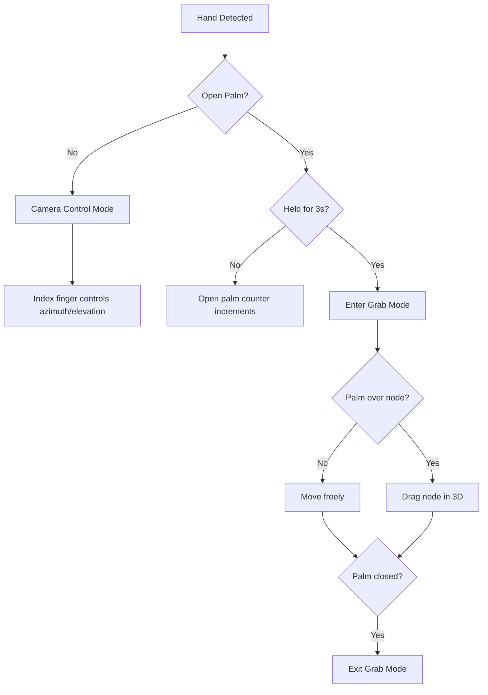

Sprout's hand tracking feature uses **MediaPipe** for hand landmark detection and **OpenCV** for webcam capture. The system runs as a standalone WebSocket server that streams hand data to the frontend.

## Overview

The hand tracking service:
- Captures webcam input at 60 fps (capped)
- Detects up to 2 hands using MediaPipe
- Streams hand landmark data via WebSocket (`ws://localhost:8765`)
- Supports natural gestures for camera control and node manipulation

<Info>
  Hand tracking is optional. Sprout works without it, but you lose the ability to control the 3D graph with hand gestures.
</Info>

## Prerequisites

<Steps>
  <Step title="Install Anaconda or Miniconda">
    Download and install Miniconda (recommended) or full Anaconda:
    
    <Tabs>
      <Tab title="macOS">
        ```bash
        # Download Miniconda installer
        curl -O https://repo.anaconda.com/miniconda/Miniconda3-latest-MacOSX-x86_64.sh
        
        # Install
        bash Miniconda3-latest-MacOSX-x86_64.sh
        
        # Verify
        conda --version
        ```
      </Tab>
      
      <Tab title="Linux">
        ```bash
        # Download Miniconda installer
        wget https://repo.anaconda.com/miniconda/Miniconda3-latest-Linux-x86_64.sh
        
        # Install
        bash Miniconda3-latest-Linux-x86_64.sh
        
        # Verify
        conda --version
        ```
      </Tab>
      
      <Tab title="Windows">
        Download the installer from [miniconda.org](https://docs.conda.io/en/latest/miniconda.html) and run it.
        
        After installation, open Anaconda Prompt and verify:
        ```bash
        conda --version
        ```
      </Tab>
    </Tabs>
  </Step>
  
  <Step title="Verify Webcam Access">
    Ensure your system has a working webcam:
    
    ```bash
    # macOS: Check camera in Photo Booth
    # Linux: Use cheese or fswebcam
    # Windows: Use Camera app
    ```
  </Step>
</Steps>

## Environment Setup

Create an isolated conda environment for hand tracking dependencies:

<Steps>
  <Step title="Create Conda Environment">
    ```bash
    cd sprout-backend
    conda create -n sprout-cv python=3.11 -y
    ```
    
    <Note>
      Use Python 3.10 or 3.11. Avoid 3.12+ as MediaPipe may have compatibility issues.
    </Note>
  </Step>
  
  <Step title="Activate Environment">
    ```bash
    conda activate sprout-cv
    ```
    
    Your prompt should change to show `(sprout-cv)`.
  </Step>
  
  <Step title="Verify Python Version">
    ```bash
    python --version
    # Should output: Python 3.11.x
    ```
  </Step>
</Steps>

## Install Dependencies

The hand tracking service requires four Python packages with specific versions:

<Tabs>
  <Tab title="From requirements.txt (Recommended)">
    ```bash
    cd sprout-backend
    conda activate sprout-cv
    pip install -r requirements.txt
    ```
    
    **requirements.txt contents**:
    ```txt
    mediapipe==0.10.14
    opencv-python==4.13.0.92
    websockets==12.0
    numpy==2.4.2
    ```
  </Tab>
  
  <Tab title="Manual Installation">
    Install packages individually:
    
    ```bash
    conda activate sprout-cv
    pip install mediapipe==0.10.14
    pip install opencv-python==4.13.0.92
    pip install websockets==12.0
    pip install numpy==2.4.2
    ```
  </Tab>
  
  <Tab title="With Cache Clearing (Troubleshooting)">
    If you encounter installation issues:
    
    ```bash
    pip install -r requirements.txt \
      --no-cache-dir \
      --default-timeout=100
    ```
    
    This clears pip cache and increases timeout for slow networks.
  </Tab>
</Tabs>

### Package Details

| Package | Version | Purpose |
|---------|---------|----------|
| `mediapipe` | 0.10.14 | Hand landmark detection (21 points per hand) |
| `opencv-python` | 4.13.0.92 | Webcam capture and image processing |
| `websockets` | 12.0 | WebSocket server for streaming data |
| `numpy` | 2.4.2 | Array operations (auto-installed by mediapipe) |

<Warning>
  **Version Pinning**: These exact versions are tested and known to work together. Using different versions may cause compatibility issues.
</Warning>

## Running the Service

Start the WebSocket server:

```bash
cd sprout-backend
conda activate sprout-cv
python backend.py
```

**Expected output**:
```
WebSocket Server started on ws://localhost:8765
```

The service is now running and waiting for connections from the frontend.

<Note>
  Keep this terminal window open while using hand tracking. The service runs continuously until you stop it with `Ctrl+C`.
</Note>

## Configuration

The hand tracking service is configured in `backend.py`:

### MediaPipe Settings

```python backend.py
mp_hands = mp.solutions.hands
hands = mp_hands.Hands(
    max_num_hands=2,              # Detect up to 2 hands
    model_complexity=0,           # 0=fast, 1=accurate
    min_detection_confidence=0.7, # Lower = more sensitive
    min_tracking_confidence=0.8,  # Higher = less jitter
)
```

<Tabs>
  <Tab title="max_num_hands">
    **Default**: `2`
    
    Maximum number of hands to detect simultaneously.
    
    ```python
    max_num_hands=1  # Single hand only
    max_num_hands=2  # Both hands (default)
    ```
  </Tab>
  
  <Tab title="model_complexity">
    **Default**: `0`
    
    MediaPipe model complexity:
    - `0` = Fastest, least accurate
    - `1` = Slower, most accurate
    
    ```python
    model_complexity=0  # Fast, good for real-time
    model_complexity=1  # Accurate, may lag on slower hardware
    ```
  </Tab>
  
  <Tab title="min_detection_confidence">
    **Default**: `0.7`
    
    Confidence threshold for initial hand detection.
    
    ```python
    min_detection_confidence=0.5  # More sensitive (more false positives)
    min_detection_confidence=0.9  # Less sensitive (may miss hands)
    ```
  </Tab>
  
  <Tab title="min_tracking_confidence">
    **Default**: `0.8`
    
    Confidence threshold for tracking already-detected hands.
    
    ```python
    min_tracking_confidence=0.7  # Smoother but more jitter
    min_tracking_confidence=0.9  # Less jitter but may lose tracking
    ```
  </Tab>
</Tabs>

### Camera Settings

```python backend.py
cap = cv2.VideoCapture(0)  # Camera index
```

<Tabs>
  <Tab title="Default Camera">
    ```python
    cap = cv2.VideoCapture(0)
    ```
    
    Uses the first available camera (index 0).
  </Tab>
  
  <Tab title="Multiple Cameras">
    ```python
    cap = cv2.VideoCapture(1)  # Use second camera
    ```
    
    List available cameras:
    ```bash
    # macOS
    system_profiler SPCameraDataType
    
    # Linux
    v4l2-ctl --list-devices
    ```
  </Tab>
</Tabs>

### Performance Settings

```python backend.py
SEND_INTERVAL = 1 / 60      # 60 fps cap
SMOOTH_ALPHA = 0.35         # Smoothing weight
PALM_HOLD_SECONDS = 3.0     # Open palm hold duration
```

<Tabs>
  <Tab title="Frame Rate">
    **Default**: `60 fps`
    
    ```python
    SEND_INTERVAL = 1 / 60   # 60 fps
    SEND_INTERVAL = 1 / 30   # 30 fps (lower CPU usage)
    ```
  </Tab>
  
  <Tab title="Smoothing">
    **Default**: `0.35`
    
    Exponential moving average (EMA) weight for position smoothing.
    
    ```python
    SMOOTH_ALPHA = 0.2   # More smoothing, more lag
    SMOOTH_ALPHA = 0.5   # Less smoothing, less lag
    ```
  </Tab>
  
  <Tab title="Grab Gesture">
    **Default**: `3.0 seconds`
    
    Duration to hold open palm before entering grab mode.
    
    ```python
    PALM_HOLD_SECONDS = 2.0  # Faster activation
    PALM_HOLD_SECONDS = 5.0  # Slower activation
    ```
  </Tab>
</Tabs>

## Gesture System

The hand tracking service recognizes two main gestures:

### 1. Camera Control (Normal Hand)

When your hand is **not** in an open palm position:
- Index finger tip position controls camera azimuth and elevation
- Camera orbits around the current focus point

**Detection**: Any finger is not fully extended.

### 2. Grab Mode (Open Palm)

Hold an **open palm** for 3 seconds to enter grab mode:
- All four fingers (index, middle, ring, pinky) must be extended
- Palm center position is tracked
- Hovering over a node while grabbing allows you to drag it in 3D space

**Open Palm Detection** (`is_open_palm`):
```python
for tip_idx, pip_idx in [(8, 6), (12, 10), (16, 14), (20, 18)]:
    tip = landmarks[tip_idx]
    pip = landmarks[pip_idx]
    extended = (
        dist(tip, wrist) > dist(pip, wrist) * 1.08  # Tip farther than PIP
        or tip.y < pip.y  # Tip above PIP (y is down in image)
    )
    if not extended:
        return False  # Not an open palm
return True
```

### Gesture Flow



## Protocol

The WebSocket server sends JSON messages at 60 fps (capped):

<CodeGroup>
```json Example Message
{
  "hands": [
    {
      "handedness": "Right",
      "x": 0.512,
      "y": 0.384,
      "z": -0.042,
      "pinch": false,
      "palm_x": 0.501,
      "palm_y": 0.412,
      "palm_z": -0.038,
      "is_open_palm": true,
      "palm_hold_duration": 3.2,
      "is_grabbing": true
    }
  ]
}
```
</CodeGroup>

### Field Definitions

| Field | Type | Description |
|-------|------|-------------|
| `handedness` | string | "Left" or "Right" |
| `x`, `y`, `z` | float | Index finger tip position (normalized 0-1) |
| `pinch` | boolean | Thumb and index finger are pinching |
| `palm_x`, `palm_y`, `palm_z` | float | Palm center position (average of wrist + 4 MCP joints) |
| `is_open_palm` | boolean | All 4 fingers are extended |
| `palm_hold_duration` | float | Seconds open palm has been held |
| `is_grabbing` | boolean | Grab mode is active (palm held for 3s) |

<Note>
  Both hands are sent when detected. The frontend uses handedness (not array index) to track gestures consistently.
</Note>

## Frontend Integration

The frontend connects to the WebSocket server from the hand tracking toggle:

```typescript
const ws = new WebSocket('ws://localhost:8765');

ws.onmessage = (event) => {
  const data = JSON.parse(event.data);
  // Process hand tracking data
};
```

**Location**: Bottom-right corner of the 3D graph view.

## Troubleshooting

<AccordionGroup>
  <Accordion title="MediaPipe module not found">
    Error: `ModuleNotFoundError: No module named 'mediapipe'`
    
    **Solution**:
    1. Verify you're in the conda environment:
       ```bash
       conda activate sprout-cv
       ```
    2. Reinstall dependencies:
       ```bash
       pip install -r requirements.txt
       ```
  </Accordion>
  
  <Accordion title="Camera permission denied">
    Error: `cv2.VideoCapture` returns `None` or blank frames.
    
    **Solution**:
    1. Grant camera permissions in system settings
    2. Close other apps using the webcam
    3. Try a different camera index:
       ```python
       cap = cv2.VideoCapture(1)
       ```
  </Accordion>
  
  <Accordion title="WebSocket connection refused">
    Frontend shows "WebSocket error: Connection refused".
    
    **Solution**:
    1. Ensure `python backend.py` is running
    2. Check the port is 8765 (default)
    3. Verify firewall isn't blocking localhost connections
  </Accordion>
  
  <Accordion title="Hand tracking is jittery">
    Hand positions jump around erratically.
    
    **Solution**:
    1. Increase smoothing:
       ```python
       SMOOTH_ALPHA = 0.2  # More smoothing
       ```
    2. Increase tracking confidence:
       ```python
       min_tracking_confidence=0.9
       ```
    3. Improve lighting conditions
    4. Use a higher quality webcam
  </Accordion>
  
  <Accordion title="Grab mode activates too easily">
    Grab mode triggers unintentionally.
    
    **Solution**: Increase palm hold duration:
    ```python
    PALM_HOLD_SECONDS = 5.0  # Require 5s hold
    ```
  </Accordion>
  
  <Accordion title="MediaPipe fails on Python 3.12+">
    Error: `ImportError: DLL load failed` or compatibility issues.
    
    **Solution**:
    1. Delete the environment:
       ```bash
       conda deactivate
       conda env remove -n sprout-cv
       ```
    2. Recreate with Python 3.11:
       ```bash
       conda create -n sprout-cv python=3.11 -y
       conda activate sprout-cv
       pip install -r requirements.txt
       ```
  </Accordion>
</AccordionGroup>

## Advanced Configuration

### Custom WebSocket Port

Change the WebSocket port in `backend.py`:

```python backend.py
async def main():
    async with websockets.serve(handler, "localhost", 9000):  # Changed from 8765
        print("WebSocket Server started on ws://localhost:9000")
        await asyncio.Future()
```

<Warning>
  If you change the port, update the frontend WebSocket connection URL to match.
</Warning>

### Multiple Camera Support

Cycle through cameras to find the correct index:

```python test_cameras.py
import cv2

for i in range(10):
    cap = cv2.VideoCapture(i)
    if cap.isOpened():
        print(f"Camera {i}: Available")
        cap.release()
    else:
        print(f"Camera {i}: Not available")
```

### Logging Hand Data

Add logging for debugging:

```python backend.py
import json

async def handler(websocket, path):
    # ... existing code ...
    
    # Log every 60 frames (1 second at 60fps)
    if frame_count % 60 == 0:
        print(f"Hand data: {json.dumps(frame_data, indent=2)}")
```

## Next Steps

<CardGroup cols={2}>
  <Card title="Document Uploads" icon="file-arrow-up" href="/development/document-uploads">
    Configure S3 for document storage
  </Card>
  
  <Card title="Running Locally" icon="play" href="/development/running-locally">
    Start all services in development mode
  </Card>
</CardGroup>